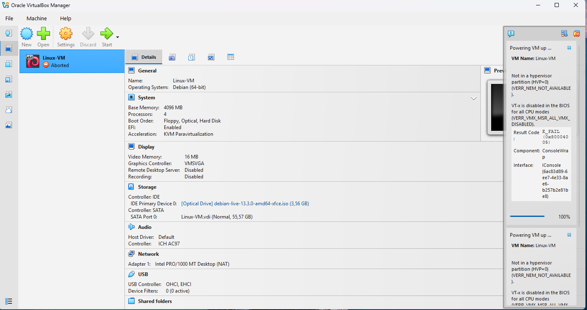
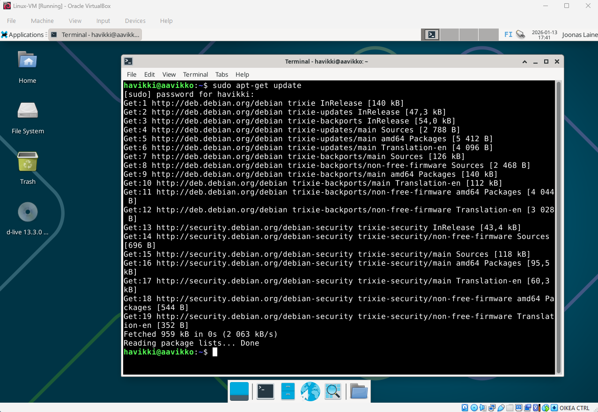

# h1 - kotitehtävä
Aloitin heti tunnin päätyttyä asentamaan virtualboxia ja sinne linuxia.
Heti kättelyssä virtualbox heitti errorit ja valitti "VT-x is disabled in the BIOS for all CPU modes". Ohessa kuvakaappaus
 

## BIOS
Googlettelin vikakoodia mikä aiemman kohdan kuvassa näkyy ja sain selville, että todennäköisesti BIOSsista pitää käydä laittamassa VT-x päälle. Se löytyi kolmannen BIOS vierailun aikana kohdasta "Virtualization Technology". Laitoin siihen enable ja sain virtuaalikoneen käyntiin

## Virtuaalikoneen käynnistys
Sain koneen päälle ja testasin näppiksen, hiiren ja netin toimivuutta käymällä selaimella googlessa hakemassa "Tero Karvinen" ja käymällä terokarvinen.com:ssa. All good

## Debianin asennus virtuaalikoneelle
All gucci taas, klikkasin virtuaalikoneen työpöydältä "Install Debian" ja kliksuttelin oikeat asetukset ohjeiden mukaan

## Terminaalikomentojen ajo
Sitte alettiinkin ajamaan terminaalikomentoja ohjeiden mukaan.

