# h2 kotitehtävä

Tekijä: Joonas Laine

Päivämäärä: 26.01.2026

Kurssi: [Linux Palvelimet](https://terokarvinen.com/linux-palvelimet/)

### Ympäristö
Isäntäkone (Host):

Windows 11 Home
Intel i9-11600K CPU
32 GB RAM
NVIDIA RTX 2080TI

Virtuaalikone (Guest):

Debian 13 (64-bit)
4096 MB RAM
4 CPU-ydintä
59 GB VDI-levy

## Karvinen 2020: Command line basics revisited - Tärkeitä komentokehotteita
Linux-käyttöjärjestelmässä on ensiarvoisen tärkeää osata toimia CLI-ympäristössä. (Command Line Interface).

Riippuen käyttöoikeuksista voit mm. asentaa, poistaa, kopioida ja uudelleennimetä ohjelmia ja tiedostoja.

Etuliitteellä ``` $ sudo ``` saat pääkäyttäjän oikeudet, jolloin voit tehdä mitä vain.

Vaikka graafiset käyttöliittymät ovat yleisempiä, CLI on edelleen korvaamaton työkalu ammattilaisille, ohjelmoijille ja järjestelmäylläpitäjille.

## Micro-editori
Erikseen asennettava teksieditori Linux-käyttöjärjestelmään joka toimii CLI-ympäristössä.

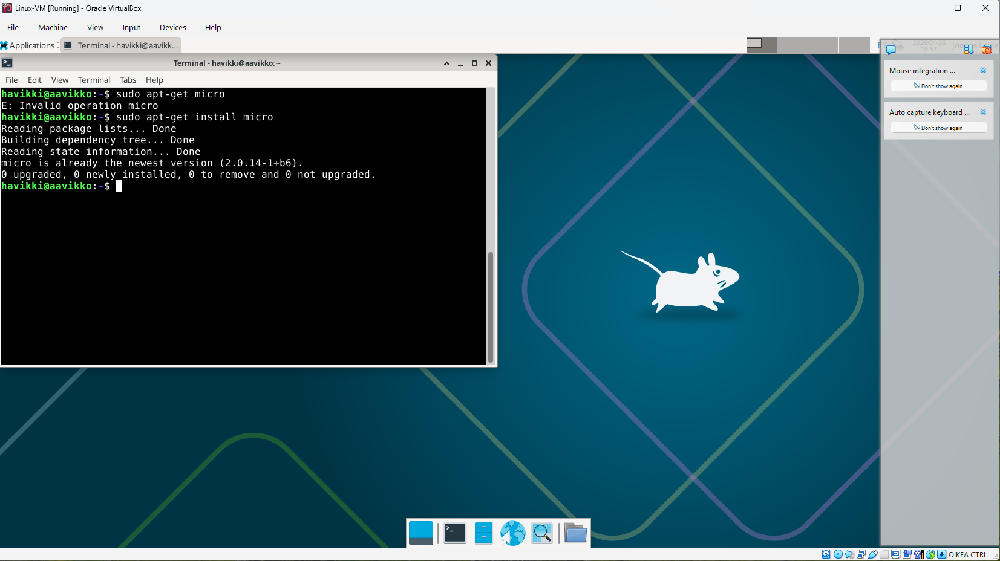

## 3 APT-komentoriviohjelmaa

Asensin kolme komentoriviohjelmaa (thefuck, git & lazygit)

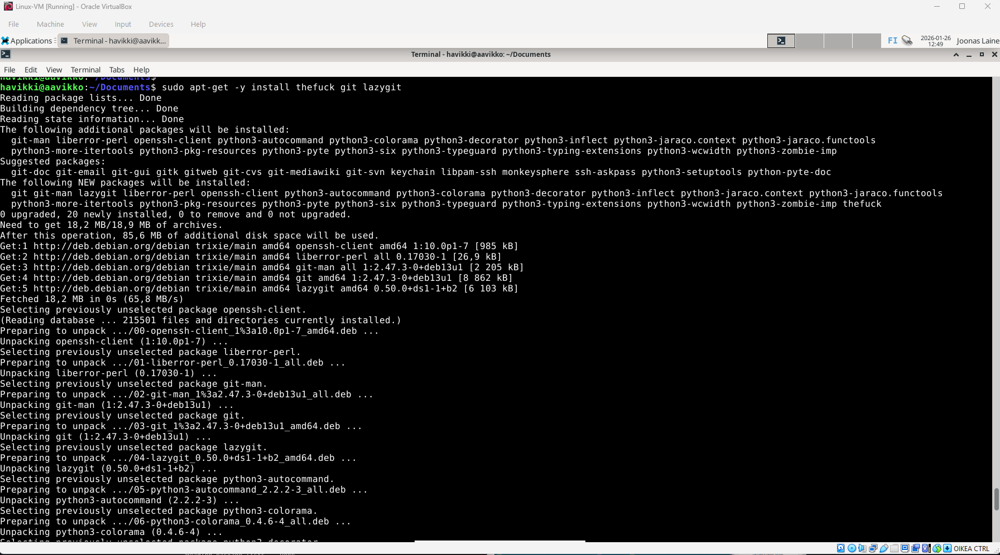

thefuck korjaa jos kirjoitat komennon väärin esim "cd.." -> "cd ..". Ihan en vielä ole oppinut käyttämään näitä kunnolla.

## Tärkeitä kansioita

Juurihakemisto

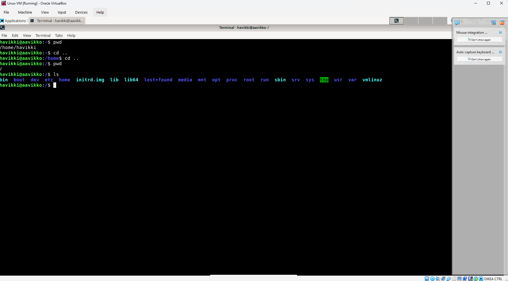

Kotihakemisto


ETC-hakemisto

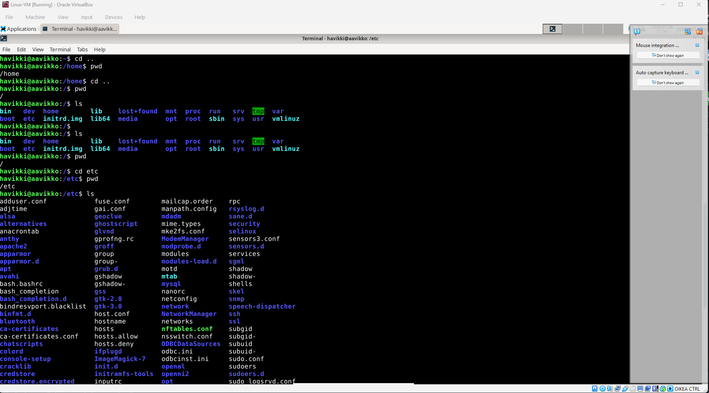

Media-hakemisto

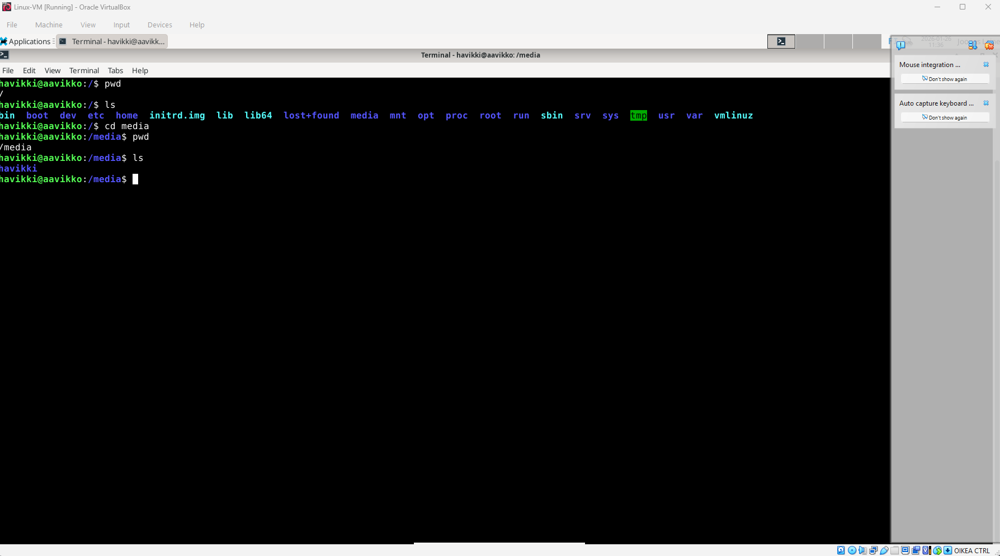

/var/log -hakemisto

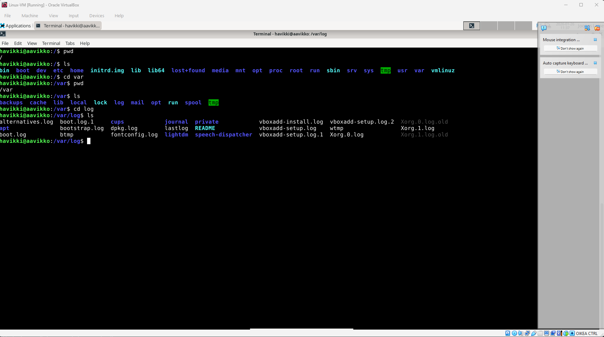

Readme /var/log -kansiosta

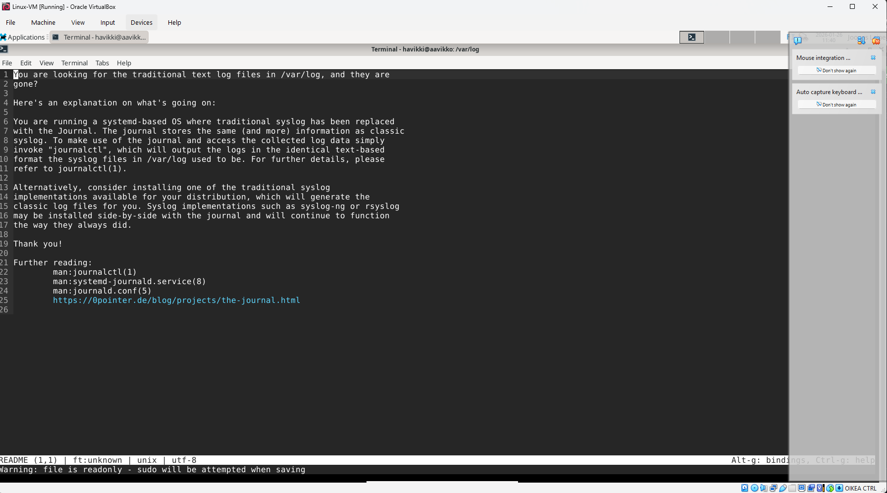

## grep-komento

Grep-komennolla voi hakea tiettyä merkkijonoa.

Esimerkeissä haettu sanaa "omena".

Tässä haettu tiedostosta "hello.md" sanaa "omena".

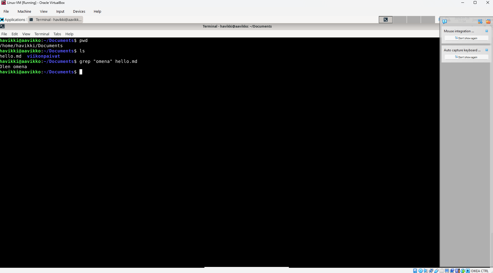

Tässä haettu tiedostosta "hello.md" sanaa "omena". Osuman löytyessä väritetty kyseinen sana


Tässä haettu omasta kotikansiosta kaikista tiedostoista sanaa "omena"

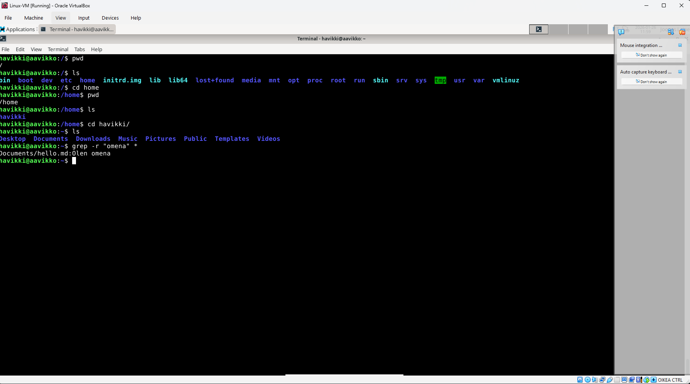

Tässä haettu omasta kotikansiosta kaikista tiedostoista sanaa "OMENA". Tarkoitus on ollut löytää sana "omena" huolimatta kirjoitusasusta. Se onnistuu komennolla -i

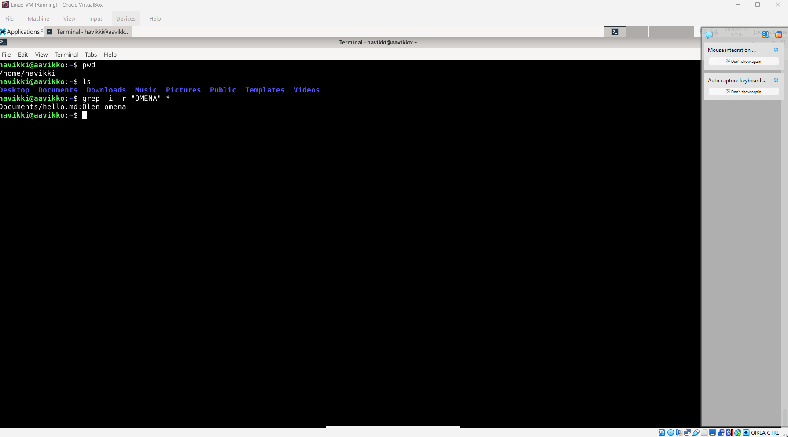

## Pipes, putket

"Putkilla" voidaan yhdistellä komentoja. Esimerkkikuvassa on käytetty "putkea" yhdistämään komento "ls -l" ja "sort -k 5".

"ls -l" listaa kaikki tiedostot kansiossa ja "sort -k 5" järjestää listan viidennen(5) kolumnin mukaan joka edustaa tiedostokokoa.

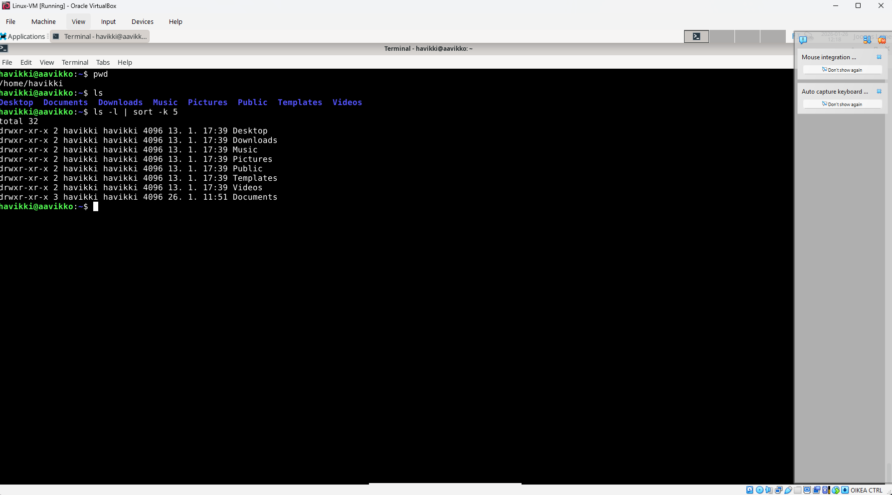

## Laitteisto - rauta

Käyttämällä komentoa ``` sudo lshw -short -sanitize ``` saadaan käytetyn koneen tietoja esiin.

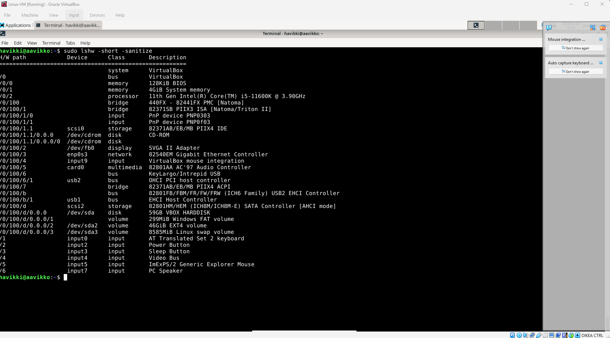

Kuvasta näkee, että käytössä on VirtualBox kautta käytettävä järjestelmä, eli virtuaalinen laite. Käytössä 4GB RAM-muistia. Prosessorina näkyy emotietokoneen prosessori. Nähdään myös mm. virtuaalikoneelle asetettu kovalevytila, 59GB.


## Lähteet
https://terokarvinen.com/2020/command-line-basics-revisited/

https://www.digitalocean.com/community/tutorials/grep-command-in-linux-unix

https://www.geeksforgeeks.org/linux-unix/piping-in-unix-or-linux/

https://github.com/nvbn/thefuck
