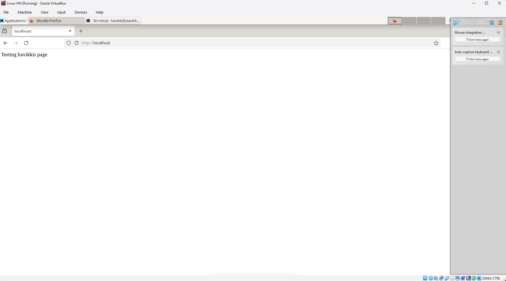

# h3 - Hello Web Server

### Apache 2.4:n virallinen dokumentaatio: Name-based Virtual Hosts

Name-based virtual hosts mahdollistavat useiden verkkosivustojen isännöinnin samalla IP-osoitteella ja portilla. Palvelin valitsee oikean sivuston HTTP-pyynnön **Host**-otsikon perusteella (esim. www.example.com).

**Toiminta:**
- Apache vertaa ensin pyynnön IP-osoitetta ja porttia.
- Sitten se etsii `<VirtualHost>`-lohkoista täsmäävän **ServerName**- tai **ServerAlias**-arvon.
- Jos useita täsmää, valitaan ensimmäinen konfiguraatiossa listattu.
- Jos mikään ei täsmää, käytetään ensimmäistä lohkoa kyseiselle IP:lle/portille (tai oletussivustoa).

**Tärkeimmät direktivit:**
- `<VirtualHost *:80>` – määrittää lohkon (voi käyttää tiettyä IP:tä tai `*`).
- **ServerName** – pakollinen, määrittää päädomainin (esim. www.example.com).
- **ServerAlias** – lisäaliakset, esim. example.com tai *.example.com.
- **DocumentRoot** – sivuston tiedostohakemisto.

**Esimerkki:**
```
<VirtualHost *:80>
    ServerName www.example.com
    ServerAlias example.com
    DocumentRoot "/www/domain"
</VirtualHost>

<VirtualHost *:80>
    ServerName other.example.com
    DocumentRoot "/www/otherdomain"
</VirtualHost>
```

**Vaatimukset ja vinkit:**
- DNS:n on ohjattava domainit palvelimen IP-osoitteeseen.
- **ServerName** kannattaa aina määrittää eksplisiittisesti.
- Konfiguraation järjestyksellä on merkitystä.
- Name-based on suositeltava tapa säästää IP-osoitteita (toisin kuin IP-based virtual hosts).

### Tero Karvisen opas (2018): Name-based Virtual Hosts Apachella

Artikkeli on käytännönläheinen opas Debian/Ubuntu-pohjaiselle järjestelmälle, miten isännöidä useita sivustoja yhdellä IP-osoitteella.

**Vaiheittainen ohje (esimerkkinä sivusto pyora.example.com):**
1. Asenna Apache: `sudo apt-get -y install apache2`.
2. Luo oletussivu: `echo "Default" | sudo tee /var/www/html/index.html`.
3. Luo uusi konfiguraatiotiedosto: `/etc/apache2/sites-available/pyora.example.com.conf`.
   Esimerkki sisältö:
   ```
   <VirtualHost *:80>
       ServerName pyora.example.com
       ServerAlias www.pyora.example.com
       DocumentRoot /home/xubuntu/publicsites/pyora.example.com
       <Directory /home/xubuntu/publicsites/pyora.example.com>
           Require all granted
       </Directory>
   </VirtualHost>
   ```
4. Ota sivusto käyttöön: `sudo a2ensite pyora.example.com` ja käynnistä Apache uudelleen: `sudo systemctl restart apache2`.
5. Luo sivuston hakemisto ja sisältö: `mkdir -p /home/xubuntu/publicsites/pyora.example.com/` ja `echo pyora > .../index.html`.
6. Testaa paikallisesti: Muokkaa `/etc/hosts`-tiedostoa lisäämällä esim. `127.0.0.1 pyora.example.com` ja testaa selaimella tai curlilla (`curl -H 'Host: pyora.example.com' localhost`).

**Vinkkejä:**
- Voit lisätä niin monta sivustoa kuin haluat samalla IP:llä.
- Paikallisesti domainit simuloidaan `/etc/hosts`-tiedostolla.
- Todellisessa käytössä domainit pitää rekisteröidä ja DNS:ssä ohjata palvelimeen.

Molemmat lähteet kuvaavat samaa periaatetta: name-based virtual hosts on tehokas tapa jakaa yksi IP-osoite useille sivustoille.

## a) Oma weppipalvelin 

Asennettu apache2-weppipalvelin komennolla ``` sudo apt-get -y install apache2 ```

Oma sivu näkyy kun kirjoitetaan osoiteriville http://localhost



## Lähteet

Jäsentelyyn käytetty Grok.com tekoälyä

https://httpd.apache.org/docs/2.4/vhosts/name-based.html

https://terokarvinen.com/2018/04/10/name-based-virtual-hosts-on-apache-multiple-websites-to-single-ip-address/
