# h5 - Nimekäs

Tekijä: Joonas Laine

Kurssi: [Linuxpalvelimet](https://terokarvinen.com/linux-palvelimet/)

Päivämäärä: 24.2.2026

### Oma domain

Ostin Namecheap.com sivustolta itselleni oman domainin joonaslaine.com


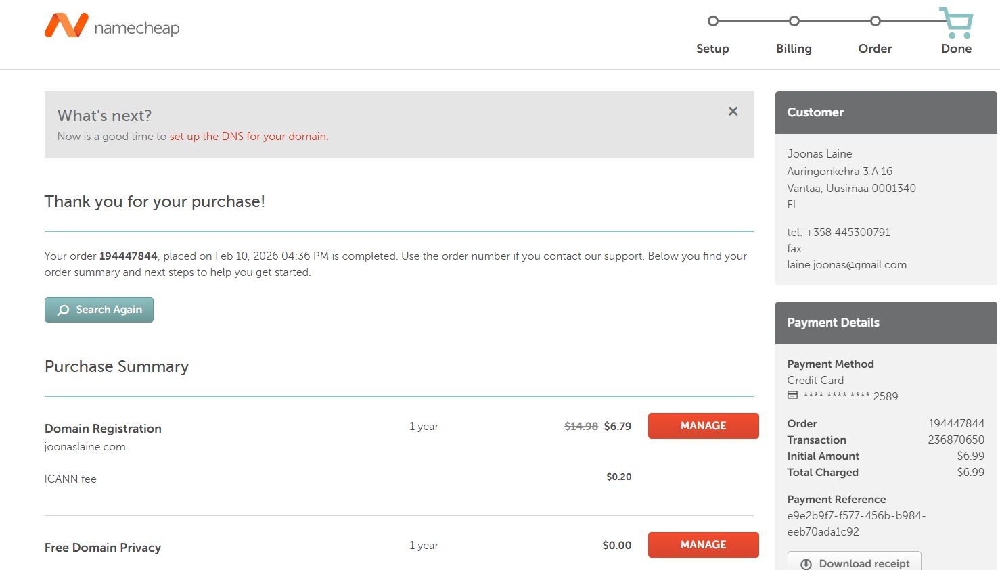

### Oma domain osoittamaan omaan palvelimeen

Seuraavaksi pitää asettaa joonaslaine.com osoittamaan omalle palvelimelle. Se tapahtuu palvelun kautta mistä nimi on ostettu muokkaamalla a-tietuetta

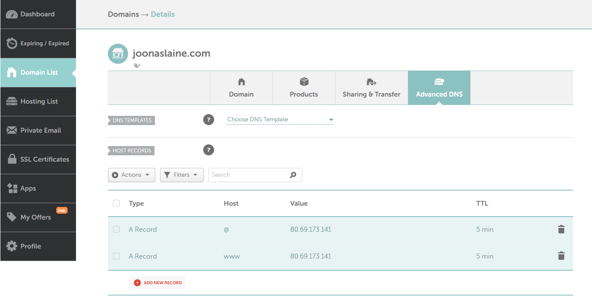

Oleellista on myös poistaa kaikki turhat härpäkkeet jotka tulevat ainakin namecheap.com -palvelussa oletuksena

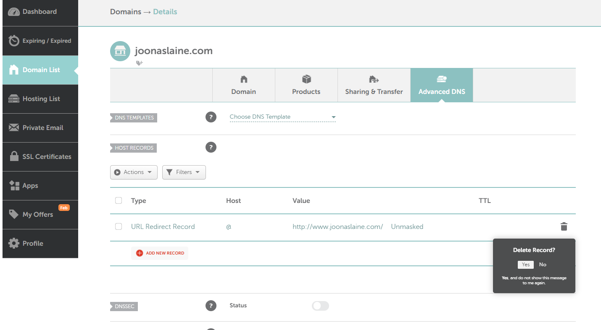

Lopuksi yritin lisätä jonkin etuliitteen omaan domainiin. Kuvan esimerkissä linux.joonaslaine.com ja linuxkurssi.joonaslaine.com, mutta nämä eivät toimineet ainakaan välittömästi kokeiltaessa selaimella.


## `dig` ja `host` Linuxissa

### `dig`

`dig` (Domain Information Groper) on DNS-kyselytyökalu.

**Mitä se tekee:**

* Hakee DNS-tietoja verkkotunnuksesta
* Näyttää IP-osoitteet (A, AAAA)
* Voi hakea myös MX-, NS-, TXT- ym. tietueita
* Näyttää tekniset tiedot vastauksesta (TTL, status, käytetty nimipalvelin)

**Esimerkki:**

```bash
dig example.com
```

**Käyttötarkoitus:**
DNS-ongelmien tarkempi selvittäminen.

---

### `host`

`host` on yksinkertaisempi DNS-hakutyökalu.

**Mitä se tekee:**

* Muuntaa verkkotunnuksen IP-osoitteeksi
* Tekee myös käänteisen haun (IP → domain)
* Näyttää vain olennaisen tiedon

**Esimerkki:**

```bash
host example.com
```

**Käyttötarkoitus:**
Nopea ja selkeä DNS-haku ilman teknisiä yksityiskohtia.

---

### Yhteenveto

* `host` → nopea perushaku
* `dig` → tarkempi ja yksityiskohtaisempi analyysi


Jotta sain dig ja host -komennot omalle koneelle piti ensin asentaa paketti dnsutils komennolla ```sudo apt-get install dnsutils```

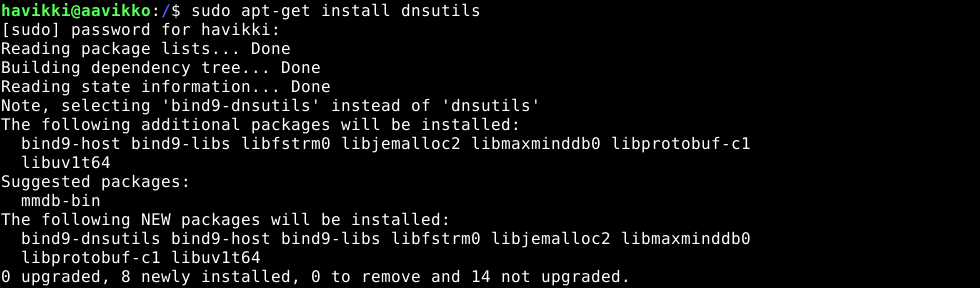

Kokeilin molempia komentoja omaan nimipalvelimeeni joonaslaine.com

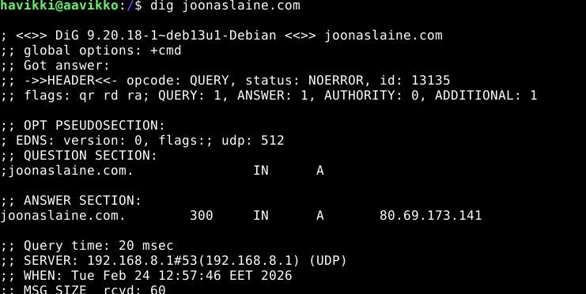

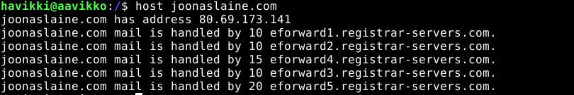

Seuraavaksi kokeilin komentoja pappaliiga.fi

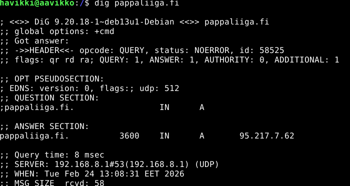

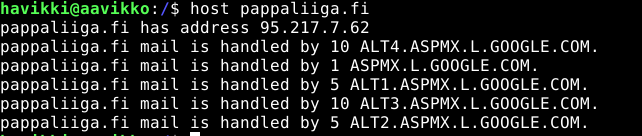

Ja lopuksi suuren yrityksen nettisivuille lahitaksi.fi

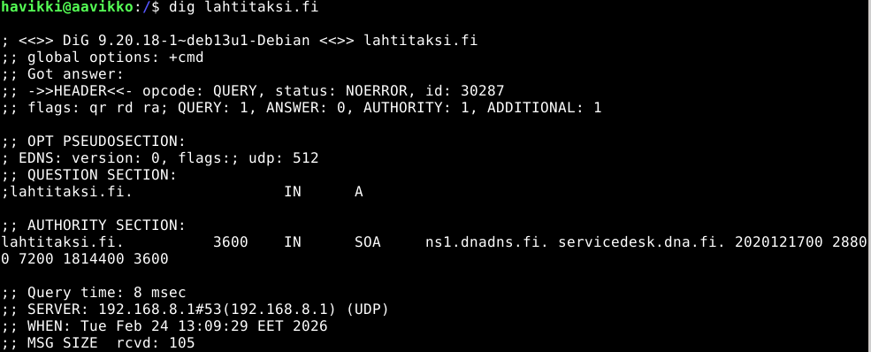

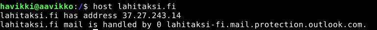

### Ongelmia aloituksessa

Minulla oli myös ongelmia alkaessani tekemään tehtäviä sillä virtuaalikoneeni ei suostunut lähtemään päälle. VirtualBox herjasi samaa mitä ensimmäisellä kurssiviikolla; VT-x on disabloitu. Kävin tässä välissä biossissa katsomassa onko asetus muuttunut todetakseni, että ei ollut. Mieleeni muistui n. viikon takainen Windowsin ilmoitus suojausasetuksen päälle laitosta "Muistin eheys". Sen suuremmin ajattelematta tämän silloin laitoin päälle ja tämä olikin ainoa mitä olin muuttanut sitten edellisen toimivan kerran. Kävinkin etsimässä kyseisen kohdan tietokoneeni asetuksista ja kävin ottamassa tämän asetuksen pois päältä. 

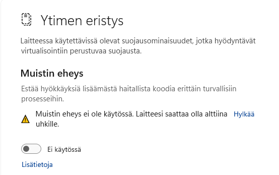

Tämän jälkeen sain virtuaalikoneeni taas päälle ja pääsin aloittamaan tehtävää, vaikkakin myöhässä.

## Päivitys etuliiteeseen 24.2.2026 klo 13.50

Sain toimimaan linux.joonaslaine.com lisäämällä CNAME-tietueen DNS-asetuksiin namecheap.com ohjauspaneelissa. Nyt siis linux.joonaslaine.com ohjautuu samalle sivulle kuin joonaslaine.com


### Lähteet

https://www.geeksforgeeks.org/linux-unix/dig-command-in-linux-with-examples/

https://terokarvinen.com/linux-palvelimet/

ChatGPT.com -tekoälyä käytetty tekstin jäsentelyyn 

https://stackoverflow.com/questions/39460123/prefix-to-domain

