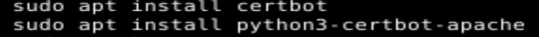
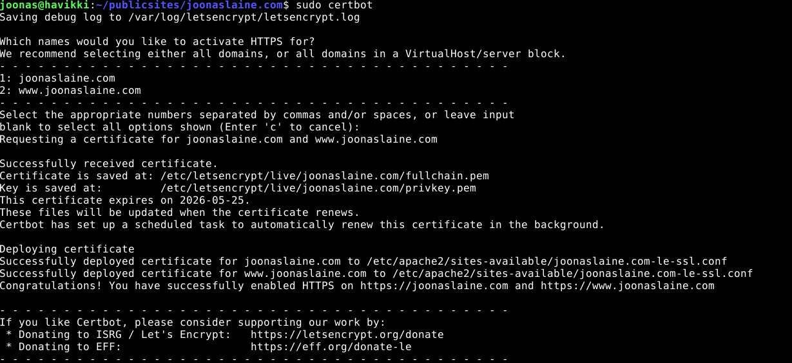
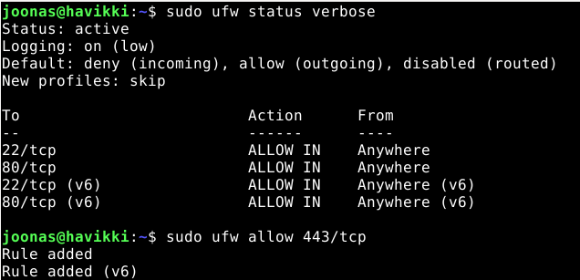
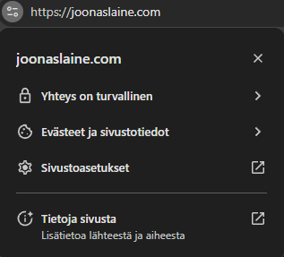
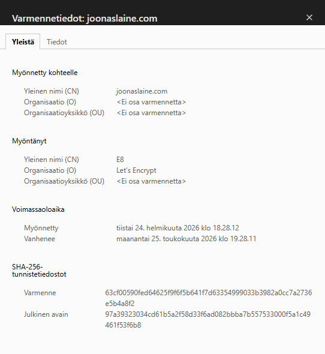
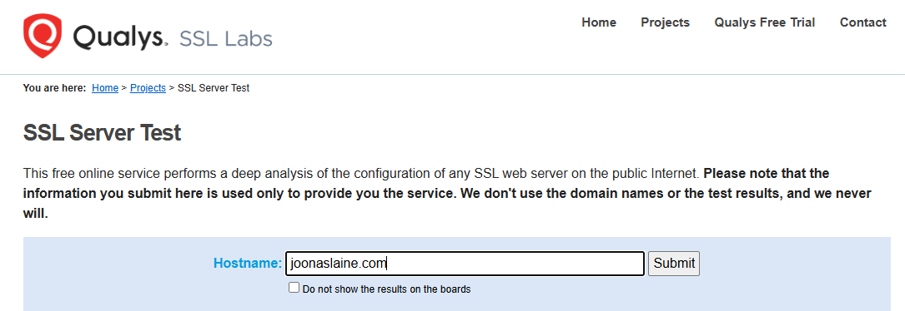
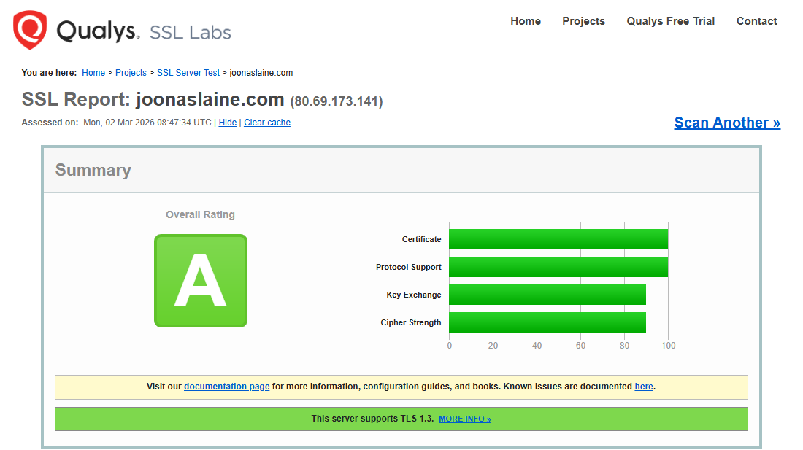

# h6 - Salataampa

Tekijä: Joonas Laine

Kurssi: [Linuxpalvelimet](https://terokarvinen.com/linux-palvelimet/)

Päivämäärä: 2.3.2026


# Apache SSL/TLS + Let's Encrypt - tiivistelmä

## Apache httpd 2.4 SSL-konfiguraatioesimerkki (mod_ssl)

- HTTPS käyttöön ottaminen vaatii **mod_ssl**-moduulin lataamisen:  
  `LoadModule ssl_module modules/mod_ssl.so`

- Kuunnellaan HTTPS-porttia:  
  `Listen 443`

- Minimikonfiguraatio SSL-virtualhostille (443):
  ```apache
  <VirtualHost *:443>
      ServerName www.example.com

      SSLEngine on
      SSLCertificateFile "/path/to/www.example.com.cert"
      SSLCertificateKeyFile "/path/to/www.example.com.key"

      # ... muut asetukset (DocumentRoot, Directory jne.)
  </VirtualHost>
  ```

- **Tärkeimmät SSL-direktiivit esimerkissä**:
  - `SSLEngine on` → SSL/TLS päälle tälle VirtualHostille
  - `SSLCertificateFile` → palvelinsertifikaatin polku (yleensä fullchain.pem Let's Encryptillä)
  - `SSLCertificateKeyFile` → yksityisen avaimen polku (privkey.pem)

- Portti 80:lle suositellaan yleensä redirectiä HTTPS:ään


## Näin Let's Encrypt toimii

- ACME-protokolla (RFC 8555) -> automaattinen keskusteluyhteys palvelimen ja Let's Encrypt CA:n välillä

- Domainin omistajuuden varmistus (yleisimmät):
  - HTTP-01: palvelin tarjoaa tiedoston polkuun `http://example.com/.well-known/acme-challenge/...`
  - DNS-01: lisätään TXT-tietueeseen `_acme-challenge.example.com`

- Sertifikaatin myöntäminen:
  
   -  ACME-client todistaa domainin hallinnan
  
   -  Lähettää Certificate Signing Requestin (CSR)
  
   -  Let's Encrypt allekirjoittaa -> palauttaa sertifikaatin

- Uusiminen täysin automaattista (sama prosessi toistuu 60–90 pv välein)

- Turvallisuus: viestit allekirjoitetaan tilin avaimella, validointi monesta näkökulmasta, ei manuaalista hyväksyntää tarvita

## Ilmaisen TLS-sertifikaatti Let's Encryptilta

- Ensiksi asennetaan tarvittavat ohjelmat palvelimelle



- Tämän jälkeen voidaan ajaa certbot. Certbot tunnisti automaattisesti omat domainit kunhan asetustiedostot olivat nimettynä oikein.



- Muista avata tarvittavat portit palomuuriin https-yhteyttä varten komennolla ```sudo ufw allow 443/tcp```



- Asennuksen jälkeen https-sivun kokeilu ja sertifikaatin olemassaolo





## Oman sivun testaus yleisellä laadunvarmistustyökalulla (SSLLabs)

 - Testasin oman sivun SSLLabs:n laadunvarmistustyökalulla. Etusivulle syötettiin oman webbisivun url ja työkalu aloitti sivustoni testauksen.



 - Hetken työskenneltyään sivusto antoi tuloksen joka näytti mukavan vihreältä




## Lähteet
https://terokarvinen.com/linux-palvelimet/

https://letsencrypt.org/how-it-works/

https://httpd.apache.org/docs/2.4/ssl/ssl_howto.html#configexample

https://www.ssllabs.com/ssltest/

Grok.com -tekoälyä käytetty tekstin jäsentelyyn
