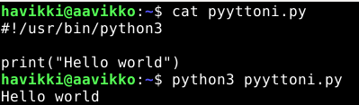
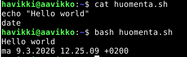
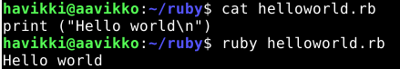
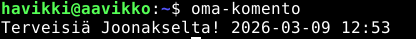
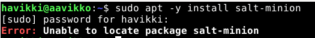

# h7 - Maalisuora

Tekijä: Joonas Laine

Kurssi: [Linuxpalvelimet](https://terokarvinen.com/linux-palvelimet/)

Päivämäärä: 9.3.2026

# Kirjoita "Hello world" kolmella kielellä

- Python:lla ```print ("Hello world")``` tiedostoon `pyyttoni.py`



- Bash:lla ```echo "Hello world"``` tiedostoon `huomenta.sh`
- Lisänä `date` mikä näyttää päivämäärän



- Ruby:lla ```print ("Hello world\n")``` tiedostoon `helloworld.rb`



# Oma järjestelmänlaajuinen komento Linuxiin

Tämä on nopein ja suositeltavin tapa luoda **kaikkien käyttäjien** käytettävissä oleva komento Linux-järjestelmään.

## Suositeltu tapa (2025–2026 standardi)

```bash

# 1. Luo komento
sudo micro /usr/local/bin/oma-komento

# 2. Kirjoita (esimerkki)
#!/usr/bin/env bash
echo "Terveisiä Joonakselta! $(date '+%Y-%m-%d %H:%M')"

# 3. Tee ajettavaksi
sudo chmod +x /usr/local/bin/oma-komento

# 4. Testaa
oma-komento
```


# Ratkaise vanha arvioitava laboratorioharjoitus soveltuvin osin

Avasin vanhan [laboratorioharjoituksen](https://terokarvinen.com/2018/03/15/arvioitava-laboratorioharjoitus-linux-palvelimet-ict4tn021-6-torstai-alkukevat-2018-5-op/?fromSearch=arvioit) ja aloin ymmärrykseni puitteissa ratkomaan tehtävää.

Heti alkuun tössähti tämä homma sillä sain virheen asentaessa pakettia `salt-minion`



Ihan ei nyt aukea mitä tässä varsinaisesti voisi tehdä, sillä kurssilla ei ole käyty tietokantoja taikka PHP:tä läpi.

## Lähteet

https://terokarvinen.com/linux-palvelimet/

https://terokarvinen.com/2018/hello-python3-bash-c-c-go-lua-ruby-java-programming-languages-on-ubuntu-18-04/

https://stackoverflow.com/questions/1122778/what-does-usr-bin-at-the-start-of-a-file-mean

Tekstin järjestelyyn käytetty Grok.com tekoälyä
